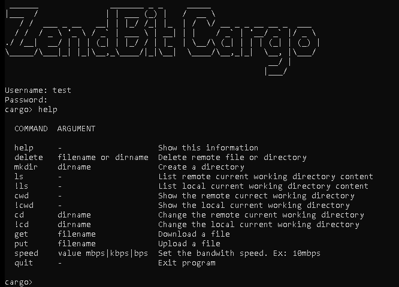

#############
Cliente Cargo
#############

**********************
Plataformas Soportadas
**********************

Actualmente esta soportado y mantenido para las siguientes plataformas y arquitecturas

+-----------------------------------+------------------------+
| Sistema Operativo                 | Arquitectura           |
+===================================+========================+
| Linux 2.6.23 or later with glibc  | amd64, 386, arm, arm64 |
+-----------------------------------+------------------------+
| macOS 10.11 or later              | amd64                  |
+-----------------------------------+------------------------+
| Windows 7, Server 2008R2 or later | amd64, 386             |
+-----------------------------------+------------------------+

***********
Instalación
***********

******************
Modos de ejecución
******************

Cliente Interactivo
===================

El cliente interactivo es muy similar a un cliente FTP en linea de comando. Para ejecutar en modo cliente basta ejecutarse de la siguiente manera:

.. note::
   # cargoclient --mode=client --host=<url>

Sincronizacion Automática
=========================

El modo de ejecucion "Sincronizacion automatica" permite dejar a Cargo Client ejecutandose con el objectivo de sincronizar una carpeta remota con una local. El modo de sincronizacion puede 
tanto para subir archivos a una ubicacion remota como descubrir nuevos archivos en un servidor remoto para descargargo.

Ejecución
---------

.. note::
   # cargoclient --mode=datasync --config=nombre_archivo

Archivo de configuracíon
------------------------

El archivo de configuracion contiene la informacion necesaria para poder sincronizar las carpetas

.. code-block:: JSON

    {
        "sync_name": "Nombre",
        "sync_mode": "download",
        "local_dir": "/CagoPlay/test/",
        "remote_dir": "/",
        "username": "test",
        "password": "test",
        "speed": "10mbps",
        "hostname": "https://cargo.cexar.io",
        "sleep": 3,
        "events": {},
    }
    

- **sync_name**: Texto libre que representa el nombre del trabajo
- **sync_mode**: "download" o "upload"
- **sleep**: Tiempo de espera para detectar nuevos archivos

    
Eventos
-------

Los eventos son utiles para integrar con otros sistemas. Cada vez que un evento se dispara realiza la accion http especificada en la configuracion.

- **onStart**: Este evento se dispara el inicio de una transferencia de archivos. Variables: FILE_NAME, TRANSFER_ID, SYNC_NAME, SYNC_MODE
- **onFinish**: Este evento se dispara al finalizar la transferencia de manera satisfactoria. Variables:FILE_NAME, TRANSFER_ID, SYNC_NAME, SYNC_MODE, AVG_SPEED, DURATION, LOST_FRAMES, AVG_RTT
- **onError**: Este evento se dispara al finalizar la transferencia de manera no satisfactoria. Variables: FILE_NAME, TRANSFER_ID, SYNC_NAME, SYNC_MODE, ERROR
- **onUpdate**: Este evento se dispara 1 vez por segundo durante toda la transferncia. Variables:  FILE_NAME, TRANSFER_ID, SYNC_NAME, SYNC_MODE, PROGRESS, SPEED

Agregar Callbacks para eventos en la configuracion
--------------------------------------------------

- **Metodos http soportados**: POST, GET, PUT, DELETE, UPDATE
- **Variables**: Cada evento tiene sus variables y estas se pueden utilizar tanto para armar la url como asi tambien para el cuerpo/body de la peticion

.. code-block:: JSON

    "events": {
        "onStart": {
           "method": "POST",
           "url": "https://api.my-system.com/cargo",
           "body": { "foo": {{ FILE_NAME }} }
        },
        "onError": {
           "method": "GET",
           "url": "https://api.my-system.com/cargo/{{ FILE_NAME }}",
        }
     } 
    

