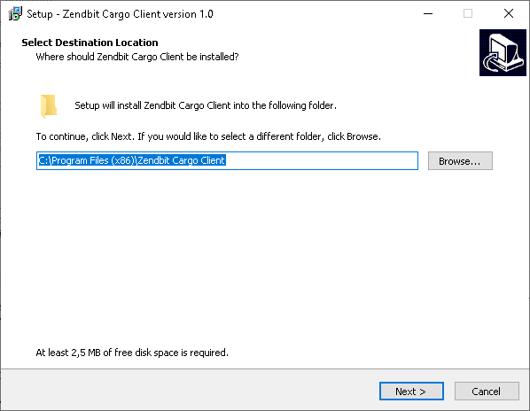

############
Cargo Client
############

*******************
Supported platforms
*******************

It is currently supported and maintained for the following platforms and architectures

+-----------------------------------+------------------------+
| Opertive System                   | Architecture           |
+===================================+========================+
| Linux 2.6.23 or later with glibc  | amd64, 386, arm, arm64 |
+-----------------------------------+------------------------+
| macOS 10.11 or later              | amd64                  |
+-----------------------------------+------------------------+
| Windows 7, Server 2008R2 or later | amd64, 386             |
+-----------------------------------+------------------------+

************
Installation
************

Windows
=======

Cargo Client can be installed by downloading the installer and following the running steps.

GNU/Linux
=========

.. code-block:: shell

   # cd /opt/
   # wget https://download.zendbit.com/cargoclient-v1.linux.tar.gz
   # tar -vxzf cargoclient-v1.linux.tar.gz
   

OSx
===

.. code-block:: shell

   # cd /opt/
   # wget https://download.zendbit.com/cargoclient-v1.osx.tar.gz
   # tar -vxzf cargoclient-v1.osx.tar.gz
   

*************
Running Modes
*************

Interactive Client
===================

The interactive client is very similar to a command line FTP client. The client mode is run as follows:

.. code-block:: shell

   # cargoclient --mode=client --host=<url>

.. image:: client.png
    :width: 400px
    :alt: Cargo Client Interactive
    :align: center

Automatic Synchronization
=========================

The "Automatic Synchronization" run mode allows to leave the Cargo Client running and synchronize a remote folder with a local one. The synchronization mode can either upload files to a remote location or discover new files on a remote server for downloading.

Running
-------

.. code-block:: shell

   # cargoclient --mode=datasync --config=nombre_archivo

Configuration File
------------------

The configuration file contains the necessary information to synchronize the folders

.. code-block:: JSON

    {
        "sync_name": "Name of the Job",
        "sync_mode": "download",
        "start_time": "10:00pm",
        "end_time": "12:00am",
        "local_dir": "/CagoPlay/test/",
        "remote_dir": "/",
        "username": "test",
        "password": "test",
        "speed": "10mbps",
        "hostname": "https://cargo.cexar.io",
        "sleep": 3,
        "events": {},
    }
    

- **sync_name**: Free text representing the name of the Job
- **sync_mode**: "download" o "upload"
- **start_time** (Optional): Time when the job will start sending/receiving files
- **end_time**  (Optional): Time when the job will finish sending/receiving files
- **speed**: Speed you will try to negotiate to send/receive files. It can be expressed in mbps, kbps or bps
- **sleep**: Timeout for detecting new files
- **events** (Optional): Callback configuration at start, update and end or error of a transfer.

Events
------

Events are useful for integration with other systems. Each time an event is triggered, the http action specified in the configuration is performed.

- **onStart**: This event is triggered at the start of a file transfer.  Variables: FILE_NAME, TRANSFER_ID, SYNC_NAME, SYNC_MODE
- **onFinish**: This event is triggered after the successful completion of the transfer. Variables: FILE_NAME, TRANSFER_ID, SYNC_NAME, SYNC_MODE, AVG_SPEED, DURATION, LOST_FRAMES, AVG_RTT
- **onError**: This event is triggered after an unsuccessful transfer. Variables: FILE_NAME, TRANSFER_ID, SYNC_NAME, SYNC_MODE, ERROR
- **onUpdate**: This event is triggered 1 time per second during the entire transfer. Variables: FILE_NAME, TRANSFER_ID, SYNC_NAME, SYNC_MODE, PROGRESS, SPEED

Adding Callbacks for Events in the Configuration
------------------------------------------------

- **Supported http methods**: POST, GET. The POST method requires the body configuration parameter.
- **Variables**: Each event has its own variables, which can be used to set up the url as well as the body of the request

.. code-block:: JSON

    "events": {
        "onStart": {
           "method": "POST",
           "url": "https://api.my-system.com/cargo",
           "body": { "foo": "{{FILE_NAME}}" }
        },
        "onError": {
           "method": "GET",
           "url": "https://api.my-system.com/cargo/{{FILE_NAME}}",
        }
     } 
    

